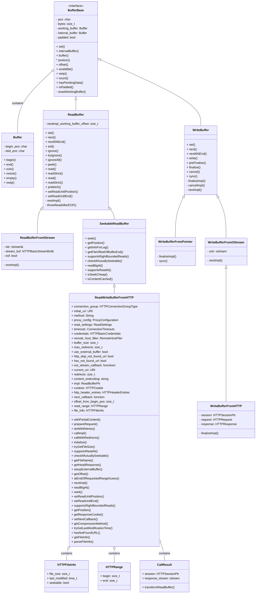

# Buffer 设计文档

## **ClickHouse Buffer** 类图

```mermaid
classDiagram
	class Buffer {
		+ begin()
		+ end()
		+ size()
		+ resize()
		+ empty()
		+ swip()
		- begin_pos: char*
		- ebd_pos: char*
	}
	class BufferBase {
		<<interface>>
		+ set()
		+ internalBuffer()
		+ buffer()
		* postion()
		+ offset()
		+ available()
		+ swip()
		+ count()
		+ hasPendingData()
		+ isPadded()
		- resetWorkingBuffer()
		- pos: char*
		- bytes: size_t
		- working_buffer: Buffer
		- internal_buffer: Buffer
		- padded: bool
	}
	class ReadBuffer {
		+ set()
		+ next()
		+ nextIfAtEnd()
		+ eof()
		+ ignore()
		+ tryIgnore()
		+ ignoreAll()
		+ peek()
		+ read()
		+ readStrict()
		+ read()
		+ readStrict()
		+ prefetch()
		+ setReadUntilPosition()
		+ setReadUntilEnd()
		- nextimpl_working_buffer_offset: size_t
		- nextImpl()
		- throwReadAfterEOF()
	}
	class WriteBuffer {
		+ set()
		+ next()
		+ nextIfAtEnd()
		+ write()
		+ preFinalize()
		+ finalize()
		+ cancel()
		+ sync()
		- finalizeImpl()
		- cancelImpl()
		- nextImpl()
	}
	class ReadBufferFromIStream {
		- istr: istream&
		- stream_buf: NTTPBasicStreamBuf&
		- eof: bool
		- nextImpl()
	}
	class SeekableReadBuffer {
		+ seek()
		+ getPosition()
		+ getInfoForLog()
		+ getFileOffsetOfBufferEnd()
		+ supportsRightBoundedReads()
		+ checkIfActuallySeekable()
		+ readBigAt()
		+ supportsReadAt()
		+ isSeekCheap()
		+ isContentCached()
	}
	class HTTPFileInfo {
		+ file_size: size_t
		+ last_modified: time_t
		+ seekable: bool
	}
	class HTTPRange {
		+ begin: size_t
		+ end: size_t
	}
	class CallResult {
		+ session: HTTPSessionPtr
		+ response_stream: istream
		+ transformReadBuffer()
	}
	class ReadWriteBufferFromHTTP {
		+ connection_group: HTTPConnectionGroupType
		+ initial_uri: URI
		+ method: String
		+ proxy_config: ProxyConfiguration
		+ read_settings: ReadSettings
		+ timeouts: ConnectionTimeouts
		+ credentials: HTTPBasicCredentials
		+ remote_host_filter: RemoteHostFiler*
		+ buffer_size: size_t
		+ max_redirects: size_t
		+ use_external_buffer: bool
		+ http_skip_not_found_url: bool
		+ has_not_found_url: bool
		+ out_stream_callback: functioon
		+ current_uri: URI
		+ redirects: size_t
		+ content_endcoding: string
		+ impl: ReadBufferPtr
		+ cookies: HTTPCookie
		+ http_header_entries: HTTPHeaderEntries
		+ next_callback: function
		+ offset_from_begin_pos: size_t
		+ read_range: HTTPRange
		+ file_info: HTTPFileInfo
		+ withPartialContent()
		+ prepareRequest()
		+ doWithRetries()
		+ callImpl()
		+ callWithRedirects()
		+ initialize()
		+ tryGetFileSize()
		+ supportsReadAt()
		+ checkIfActuallySeekable()
		+ getFileName()
		+ getHeadResponse()
		+ setupExternalBuffer()
		+ getOffset()
		+ atEndOfRequestedRangeGuess()
		+ nextImpl()
		+ readBigAt()
		+ seek()
		+ setReadUntilPosition()
		+ setReadUntilEnd()
		+ supportsRightBoundedReads()
		+ getPosition()
		+ getResponseCookie()
		+ setNextCallback()
		+ getCompressionMethod()
		+ tryGetLastModificationTime()
		+ hasNotFoundURL()
		+ getFileInfo()
		+ parseFileInfo()
	}
	class WriteBufferFromPointer {
		- finalizeImpl()
		- sync()
	}
	class WriteBufferFromOStream {
		- nextImpl()
		- ostr: ostream*
	}
	class WriteBufferFromHTTP {
		- finalizeImpl()
		- session: HTTPSessionPtr
		- request: HTTPRequest
		- response: HTTPResponse
	}
	BufferBase o-- Buffer : contains
	BufferBase <|-- ReadBuffer
	BufferBase <|-- WriteBuffer
	ReadBuffer <|-- ReadBufferFromIStream
	ReadBuffer <|-- SeekableReadBuffer
	SeekableReadBuffer <|-- ReadWriteBufferFromHTTP
	ReadWriteBufferFromHTTP o-- HTTPFileInfo : contains
	ReadWriteBufferFromHTTP o-- HTTPRange : contains
	ReadWriteBufferFromHTTP o-- CallResult : contains
	WriteBuffer <|-- WriteBufferFromPointer
	WriteBuffer <|-- WriteBufferFromOStream
	WriteBufferFromOStream <|-- WriteBufferFromHTTP
```

